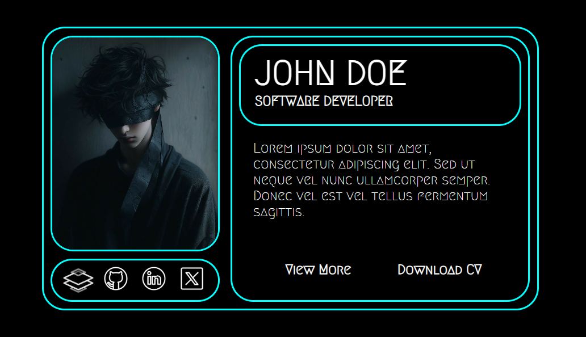

# Cyber_TagX🚀

A futuristic **Cyberpunk-Themed Profile Card** designed using **HTML and CSS**. This card features a sleek bento grid layout and interactive social icons with hover animations, giving it a dynamic and modern look.

## ✨ Features

- **Bento Grid Layout**: Uses **CSS Flexbox** to create well-structured, responsive grid containers.😎
- **Animated Social Icons**: Hover over the icons to see smooth, eye-catching animations.👀
- **Cyberpunk Aesthetics**: Neon colors, glowing effects, and a sleek futuristic design.✨
- **Google Fonts Integration**: Uses the stylish **Megrim** font for a futuristic look.🚀
- **Fully Responsive**: Adapts well to different screen sizes with a mobile-friendly layout.📱💻

---

## 📷 Preview



---

## 🔧 Technologies Used

- **HTML5**
- **CSS3 (Flexbox, Animations)**
- **Google Fonts** (Megrim)

---

## 📂 Installation & Usage

1. Clone this repository:
   ```bash
   git clone https://github.com/Muthukumaran-Official/Cyber_TagX.git
   ```
2. Open `index.html` in your browser.

---

## 🎨 Customization

You can modify the following elements to suit your style:
- **Profile Image**: Replace `hacker.jpg` with your own profile picture.
- **Colors**: Change the neon and background colors in `profile_card.css`.
- **Icons**: Update social media icons and links (`profile_card_icons/`).
- **Fonts**: Modify `Megrim` font if desired.
- **Text Content**: Change name, designation, description, and links in `profile_card.html`.

---

## 🛠 Future Enhancements

- Add **dark/light mode toggle**.
- Improve accessibility features.
- Add more animation effects.

---

## 📜 License

This project is **open-source** and available under the **MIT License**.

---

## 🤝 Connect With Me

- [GitHub](https://github.com/Muthukumaran-Official)
- [LinkedIn](https://www.linkedin.com/in/muthukumaran-poovelan/)

---

## 🧑🏻‍💻 Credits

Designed and Developed by @Muthukumaran-Official

---
Feel free to contribute or drop suggestions! 🚀
